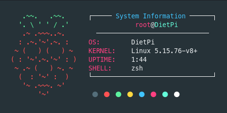

# PiFetch

A simple script to display system information on my Raspberry Pi.



## Instalation

```bash
git clone https://github.com/spectrasonic117/pifetch.git
cd pifetch
sudo make install
```

---

All credits for the original [**ufetch Script**](https://gitlab.com/jschx/ufetch) go to [**jschx**](https://gitlab.com/jschx)

<br>

<p align="right"> with  by <strong>Spectrasonic</strong></p>
